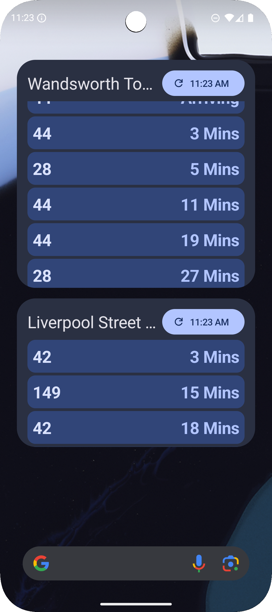
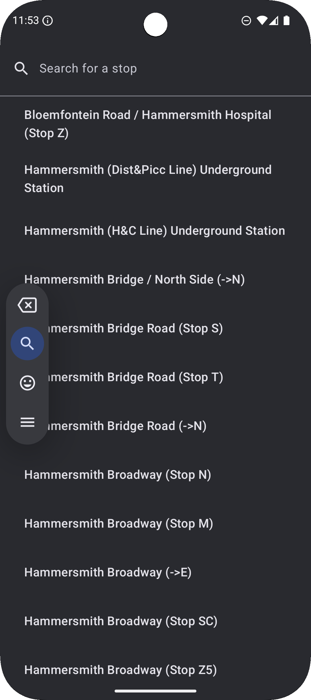
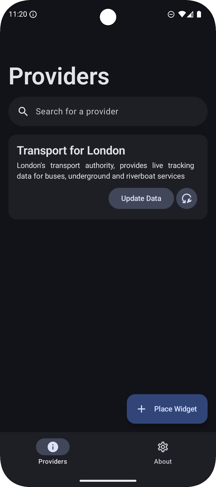
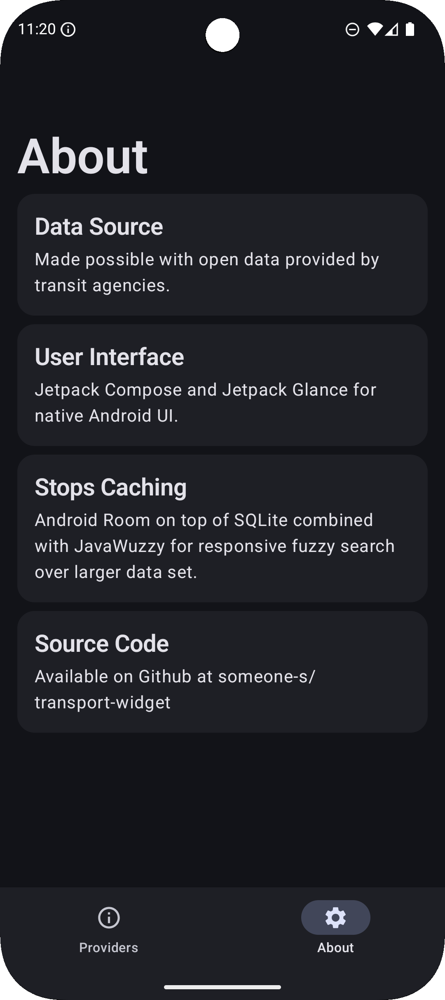

# Transport Widget
[](https://f-droid.org/packages/com.eden.livewidget/)


Only London buses, tubes and riverbus services supported at the moment.

View live arrival information at stops directly on your home screen. Simply search for your stop by name and add it to the home screen widget. View multiple stops simultaneously with multiple widgets.

Supports Android 7 to 16.


|                                            Widget |                 Search Screen                  |                  Provider Screen                   | About Screen                                 |
|--------------------------------------------------:|:----------------------------------------------:|:--------------------------------------------------:|:---------------------------------------------|
|  |  |  |  |

## Adding Widgets
Widgets can be added to the home screen from the home screen or from the app (Android 8+).

Adding widgets from the home screen varies between device manufactures (Samsung, Google), but the overall process should match the process descirbed by the ["Add apps, shortcuts and widgets to your home screens"](https://support.google.com/android/answer/9450271?hl=en-GB#zippy=%2Cadd-or-resize-a-widget) Android support article.

To add widgets from the app (Android 8+), use the "Place Widget" button at the bottom right corner in the Providers screen.

## Updating Data Source
The list of all stops from a transport agency/provider is cached and stored on device for quick searching.

The list may become out of date overtime as new stops are added, users can update the list via the providers page.

As this functionality directly talks to the respective agencies' services, it may encounter unexpected error, potentially corrupting the local cached dataset. In such cases, the list of stops can be reset to the list bundled with the app, using the reset button.

## Building From Source
Android Studio is the environment used for development, however, the app can also be built from the command line.

Gradle has to be installed.
```
gradlew :app:assembleRelease
```

## Data Source Acknowledgement
### Transport for London
- Data from London are powered by TfL Open Data under OGL v2.0
- Transport for London does not endorse this project in any way
- May contain OS data © Crown copyright and database rights 2016
- May contain Geomni UK Map data © and database rights 2019
