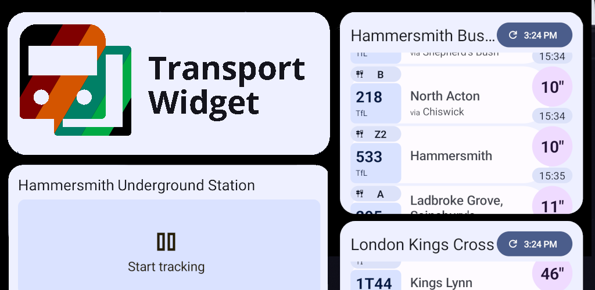
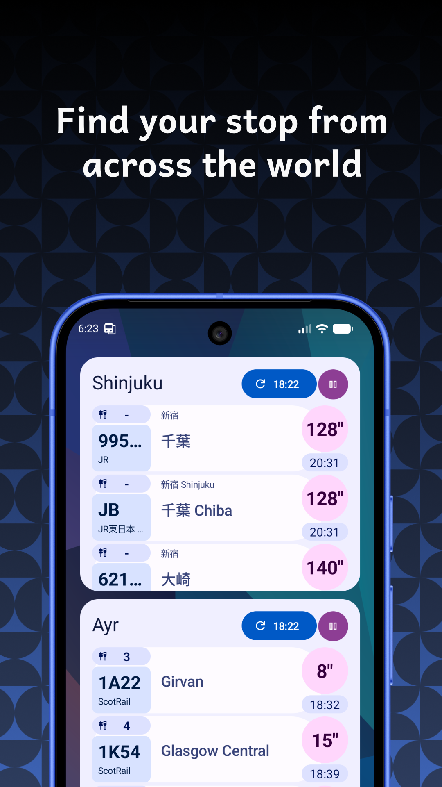
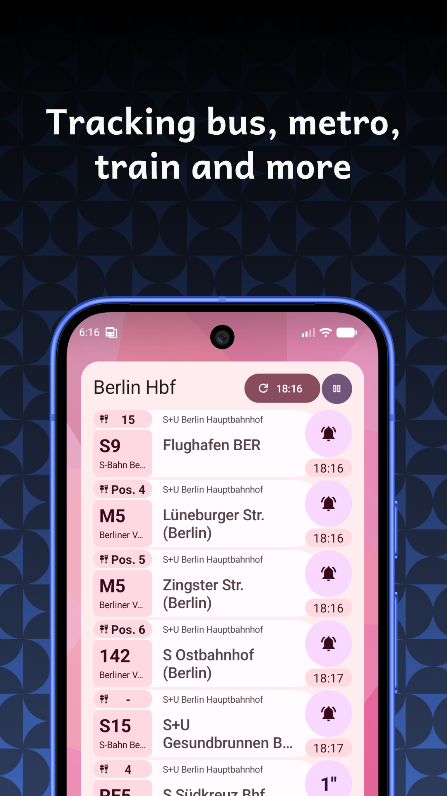
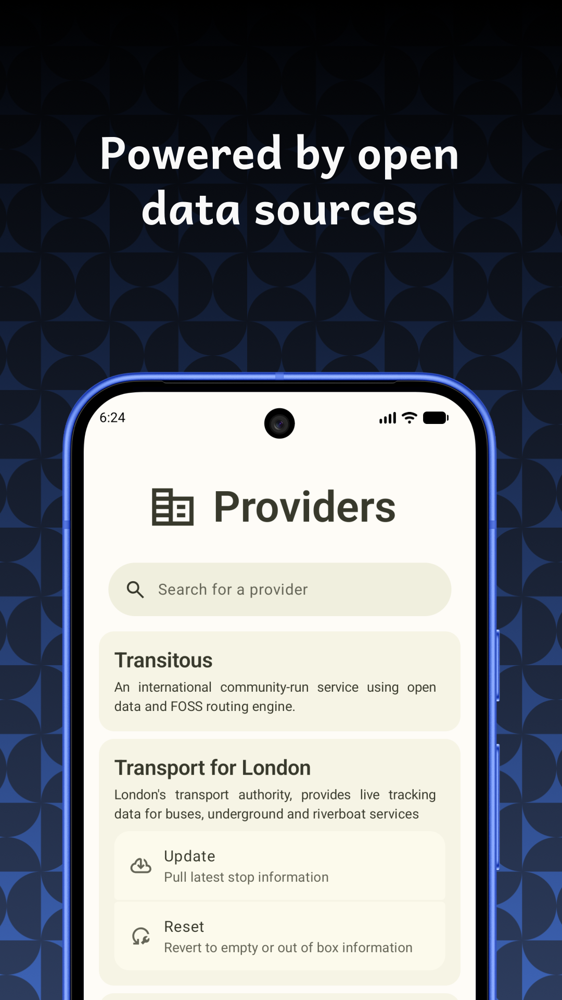

# Transport Widget

An app that provides home screen widgets displaying live arrival times of public transit services, supports multiple data source.

Utilize [Transitous](https://transitous.org/) as global data source, data feed directly from [Transport for London](https://api-portal.tfl.gov.uk/) and [Rail Delivery Group](https://raildata.org.uk/) also provided.

Supports Android 7 to 16.

## Getting the App
Android (F-Droid)                            |	Android (Play Store)                            |	Android (Release Page)
-------------------------------------------------------:|:-------------------------------------------------------:|:-------------------------------------------------------
[](https://f-droid.org/packages/com.eden.livewidget/) | [Closed Testing Google Group](https://groups.google.com/g/transport-widget-closed-testing) | [Release Page](https://github.com/someone-s/transport-widget/releases)

I'm in the process of getting the app published on Play Store.

I am looking for people to participate in closed testing to meet [Google's requirements](https://support.google.com/googleplay/android-developer/answer/14151465?hl=en-GB) to publish the app.

Join the [Google Group](https://groups.google.com/g/transport-widget-closed-testing) and follow the instructions within to help with the publishing process.

## How do I...?
Refer to the individual help page on the [Wiki](https://someone-s.github.io/transport-widget/)


## Screenshots


|                                            Widget |                 Config Screen                  |                  Home Screen                   | About Screen                                 |
|--------------------------------------------------:|:----------------------------------------------:|:----------------------------------------------:|:---------------------------------------------|
|  |  |  |  |

## Building From Source
Android Studio is the environment used for development, however, the app can also be built from the command line.

Gradle has to be installed.
```
gradlew :app:assembleRelease
```

## Data Source Acknowledgement
Refer to the individual provider page on the [Wiki](https://someone-s.github.io/transport-widget/)
